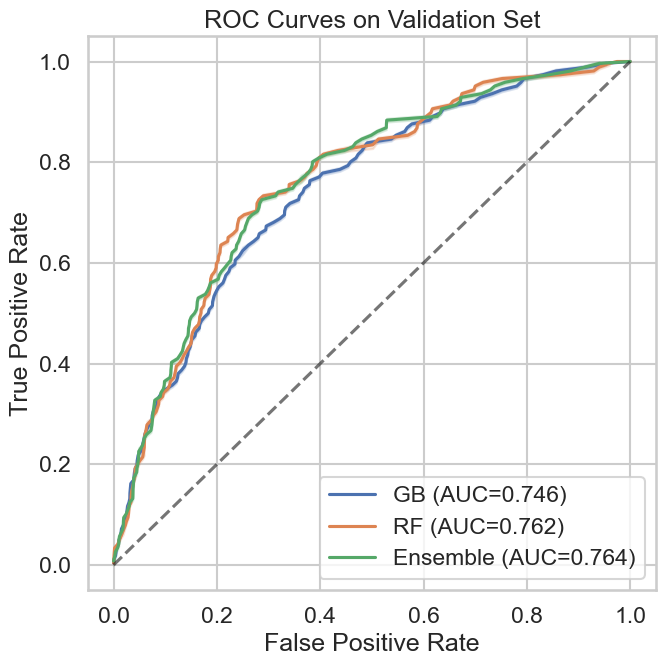

# Music Streaming Churn

Predicting ten-day cancellation from listening, session and subscription behavior.
The original course project, by **Ryan Balech and Gabriel Dreik**, processed **17.5 million training events** and engineered **58 user-level predictors**. A gradient-boosting/random-forest ensemble recorded **0.764 validation ROC AUC**. The team placed **1st of 40 teams** in the course competition.

This repository preserves the original experiment and provides a modular event-log pipeline with explicit observation windows, scalable SQL aggregation and reproducible evaluation.

## Original experiment

| Model | Validation ROC AUC |
| --- | ---: |
| Gradient boosting | 0.746 |
| Random forest | 0.762 |
| 70% gradient boosting + 30% random forest | **0.764** |

These numbers come from the supplied notebook's saved outputs: 18,880 users, a stratified 80/20 user split, a November 10, 2018 observation cutoff and a ten-day label horizon. They measure held-out users at one cutoff, rather than performance at a later date. The course rank is the authors' reported competition outcome; it is separate from these validation scores.



*Original notebook figure; not a rerun of the revised pipeline.* Exact values, input counts and provenance are recorded in [results/original_notebook.json](results/original_notebook.json).

## Pipeline

- **Parquet → DuckDB → user features:** event and session aggregation stays in DuckDB; only the user-level matrix enters Python. Memory limits and a temporary spill directory are configurable.
- **Temporal labeling:** features use events at or before the cutoff; cancellations in the following ten days define the target. Users who already cancelled are excluded from the default cohort.
- **Behavioral features:** listening diversity, session activity, account tenure, recency, subscription changes, interaction rates and recent engagement, with a stable 58-column schema.
- **Evaluation:** disjoint 60/20/20 user splits, logistic and prevalence baselines, gradient boosting, random forest and the original fixed-weight ensemble. Decision thresholds are chosen on validation data; the final test reports ROC AUC, average precision, Brier score, confusion matrices and precision/recall at a fixed 10% contact budget.
- **Uncertainty and provenance:** stratified user-bootstrap intervals, input SHA-256, split fingerprints, seeds, model configuration and package versions are saved with each run.
- **Forward evaluation:** fit on an earlier labeled cohort and score a later cutoff, enforcing that training labels have matured before the evaluation window.

## Run

Python **3.12** is tested in CI. No GPU is required.

```bash
python -m venv .venv
# Activate .venv using your shell's activation command.
python -m pip install -e ".[dev]"
python -m churn.cli demo --output runs/demo
python -m pytest -q
```

The demo generates fabricated events for software validation. Its scores are **not research results**. Original event data is not distributed here; a full revised real-data run remains pending those inputs.

For your own Parquet logs, follow the [data contract](docs/DATA.md):

```bash
python -m churn.cli evaluate --events data/events.parquet \
  --cutoff 2018-11-10 --horizon-days 10 --output runs/holdout \
  --memory-limit 2GB --threads 2 --bootstrap 1000
```

A chronological evaluation needs logs covering both complete label windows:

```bash
python -m churn.cli forward --events data/events.parquet \
  --cutoff 2018-10-20 --evaluation-cutoff 2018-11-10 \
  --horizon-days 10 --output runs/forward
```

Outputs include `evaluation.json`, `heldout_predictions.csv` and `models.joblib`. Runs and private data are ignored by Git. Only load model files from a trusted source.

## Repository guide

| Path | Purpose |
| --- | --- |
| `src/churn/features.py` | Cutoff-safe event/session aggregation and cohort construction |
| `src/churn/evaluation.py` | Splits, models, validation thresholds, metrics and bootstrap |
| `src/churn/cli.py` | Demo, held-out-user and forward evaluation commands |
| `tests/` | Event-window, feature-schema, label and evaluation invariants |
| `notebooks/original_churn_experiment.ipynb` | Archived course workflow with portable data paths |
| `docs/METHODOLOGY.md` | Evaluation choices, historical differences and limitations |

The updated protocol changes eligibility and validation, so its eventual scores should not be treated as a direct improvement over the original notebook without a controlled comparison.
